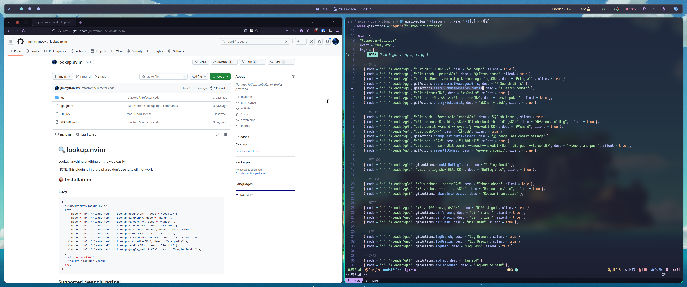
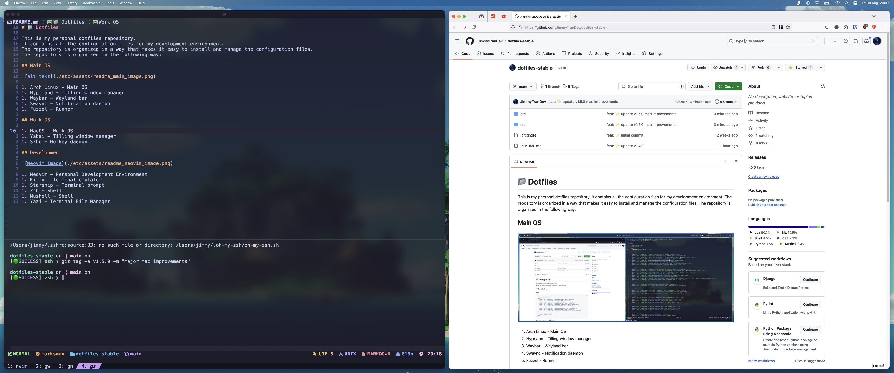
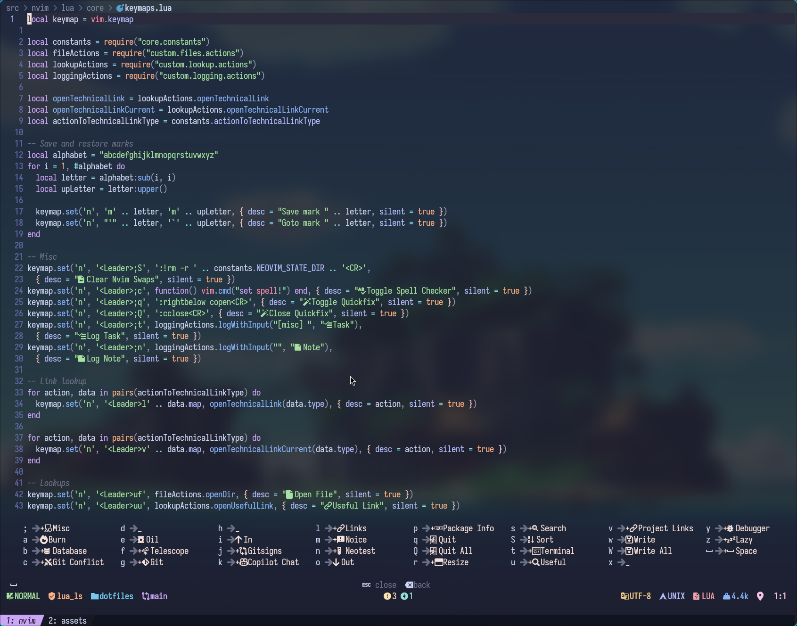

# 📁 Dotfiles

This is my personal dotfiles repository.
It contains all the configuration files for my development environment.
The repository is organized in the following way:

## HomeOS

1. Arch Linux - Operating system used at home
1. Hyprland - Tilling window manager
1. Waybar - Wayland bar
1. Swaync - Notification daemon
1. Fuzzel - Runner

## WorkOS

1. MacOS - Operating system used at work
1. Yabai - Tilling window manager
1. Skhd - Hotkey daemon
1. Raycast - Runner

## Development

1. Neovim - Personal development environment
1. Kitty - Terminal emulator
1. Starship - Terminal prompt
1. Zsh - Shell
1. Nushell - Shell
1. Yazi - Terminal File Manager

## Install Scripts

These are the scripts that install packages and link the configuration files to the correct location.

